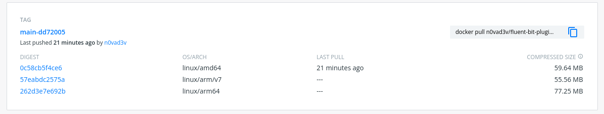

# fluent-bit-plugin-loki Multi-Arch

This is the **Non-official** but **Multi-Arch** build of `fluent-bit-plugin-loki`, refers to `grafana/fluent-bit-plugin-loki`.

Builds are made available via GitHub Actions, built once a day.

## Supported platforms

* linux/amd64
* linux/arm64
* linux/arm/v7

## Images

This repo will provide the following images:

* `n0vad3v/fluent-bit-plugin-loki:main`
* `n0vad3v/fluent-bit-plugin-loki:main-<hash>` (e,g: `n0vad3v/fluent-bit-plugin-loki:main-dd72005`)
* `ghcr.io/n0vad3v/fluent-bit-plugin-loki:main`
* `ghcr.io/n0vad3v/fluent-bit-plugin-loki:main-<hash>` (e,g: `ghcr.io/n0vad3v/fluent-bit-plugin-loki:main-dd72005`)

Of course all of them are Multi-Arch.

Enjoy!